<picture>
  <source media="(prefers-color-scheme: dark)" srcset="./assets/header-dark.svg">
  
</picture>

I'm a software engineering student at İzmir University of Economics and I've been writing code since 2018.
I'm at home in Rust and Python and comfortable across the stack, from training a model to shipping the
app it sits behind. I also lead small teams and keep projects on schedule.

 

<picture>
  <source media="(prefers-color-scheme: dark)" srcset="./assets/stack-dark.svg">
  
</picture>

 

<samp>public work</samp>

**[Matrix](https://github.com/sezaiarda/Matrix)** &nbsp;<samp>rust</samp> 
A Claude Code-first IDE with Telegram Q&A and an auto-accept plan mode.

**[WoW](https://github.com/sezaiarda/WoW)** &nbsp;<samp>python</samp> 
Finds every word you can build from a set of letters, for the Turkish Words of Wonders.

 

<samp>[linkedin](https://www.linkedin.com/in/muhammed-sezai-761711294/) &nbsp;ᐧ&nbsp; [github](https://github.com/sezaiarda)</samp>
